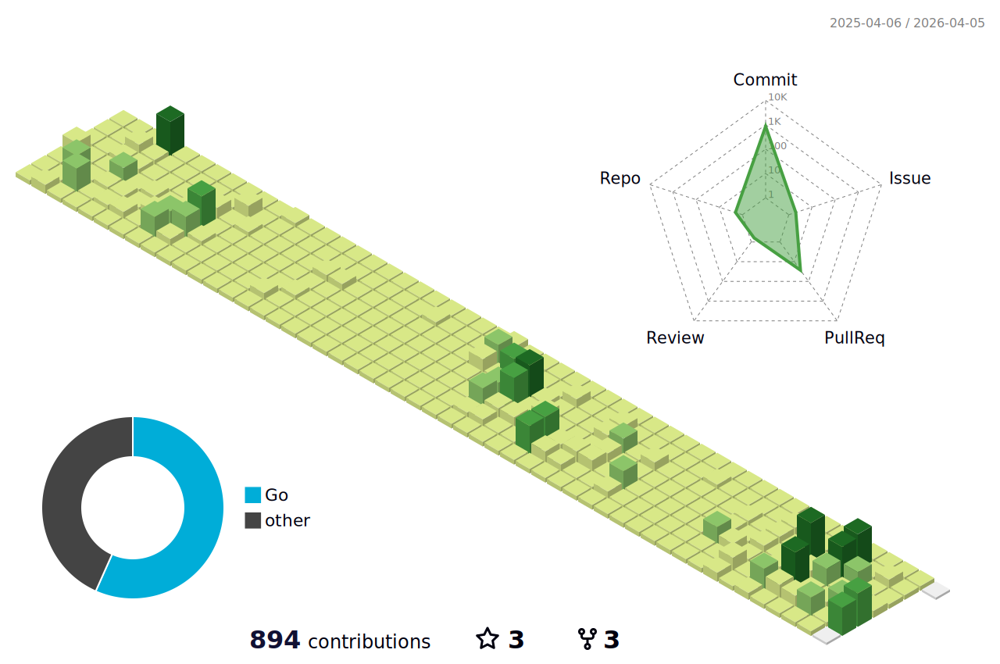

[](https://git.io/typing-svg)


<!--START_SECTION:waka-->

```txt
Python       20 hrs 3 mins   ████████████████████░░░░░   80.51 %
Go           3 hrs           ███░░░░░░░░░░░░░░░░░░░░░░   12.10 %
Other        1 hr 19 mins    █▒░░░░░░░░░░░░░░░░░░░░░░░   05.34 %
Thrift       13 mins         ▒░░░░░░░░░░░░░░░░░░░░░░░░   00.90 %
JSON         6 mins          ░░░░░░░░░░░░░░░░░░░░░░░░░   00.44 %
```

<!--END_SECTION:waka-->

<!--   profile-green-animate -->


<!--  2d history skills -->
</img>

<p align="center"> 
<a href="https://github.com/ryo-ma/github-profile-trophy"></a>
</p>

</img>
