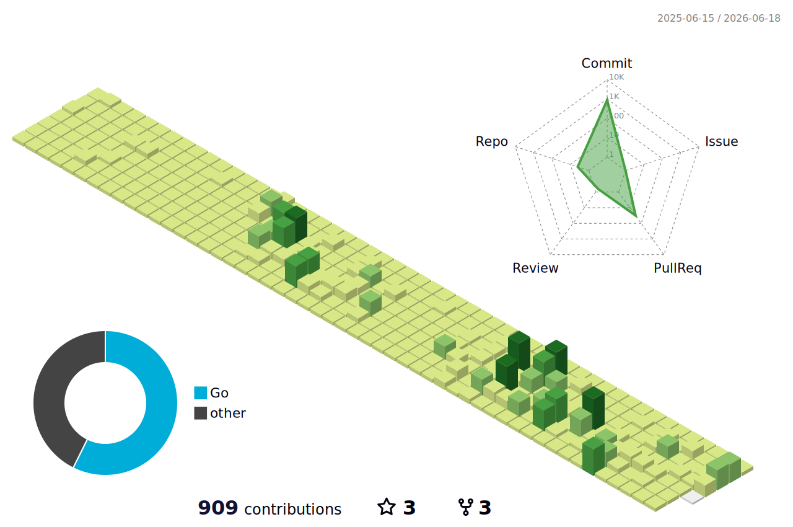

[](https://git.io/typing-svg)


[](https://codetime.dev)

<!--START_SECTION:waka-->

```txt
Go           27 hrs 6 mins         █████████████████████▒░░░   85.18 %
Python       2 hrs 14 mins         █▓░░░░░░░░░░░░░░░░░░░░░░░   07.05 %
Other        1 hr 3 mins           ▓░░░░░░░░░░░░░░░░░░░░░░░░   03.33 %
Markdown     41 mins               ▓░░░░░░░░░░░░░░░░░░░░░░░░   02.16 %
JSON         22 mins               ▒░░░░░░░░░░░░░░░░░░░░░░░░   01.16 %
```

<!--END_SECTION:waka-->

<!--   profile-green-animate -->


<!--  2d history skills -->
</img>

<p align="center"> 
<a href="https://github.com/ryo-ma/github-profile-trophy"></a>
</p>

</img>
