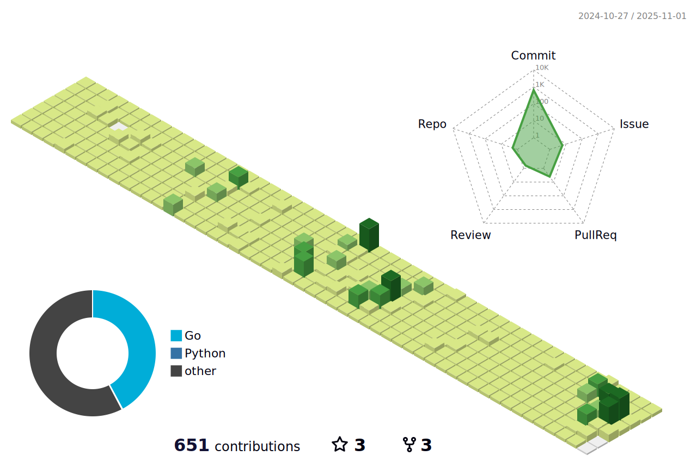

[](https://git.io/typing-svg)


[](https://codetime.dev)

<!--START_SECTION:waka-->

```txt
Go           26 hrs 27 mins  ██████████████████▒░░░░░░   73.43 %
Python       5 hrs 31 mins   ███▓░░░░░░░░░░░░░░░░░░░░░   15.31 %
YAML         1 hr 19 mins    █░░░░░░░░░░░░░░░░░░░░░░░░   03.66 %
JSON         50 mins         ▓░░░░░░░░░░░░░░░░░░░░░░░░   02.32 %
Other        44 mins         ▓░░░░░░░░░░░░░░░░░░░░░░░░   02.07 %
```

<!--END_SECTION:waka-->

<!--   profile-green-animate -->


<!--  2d history skills -->
</img>

<p align="center"> 
<a href="https://github.com/ryo-ma/github-profile-trophy"></a>
</p>

</img>
